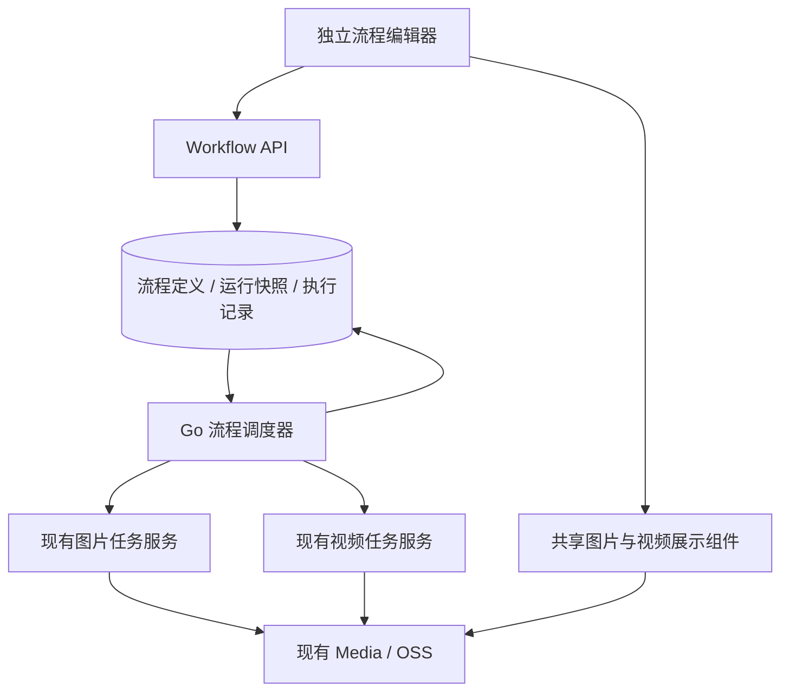
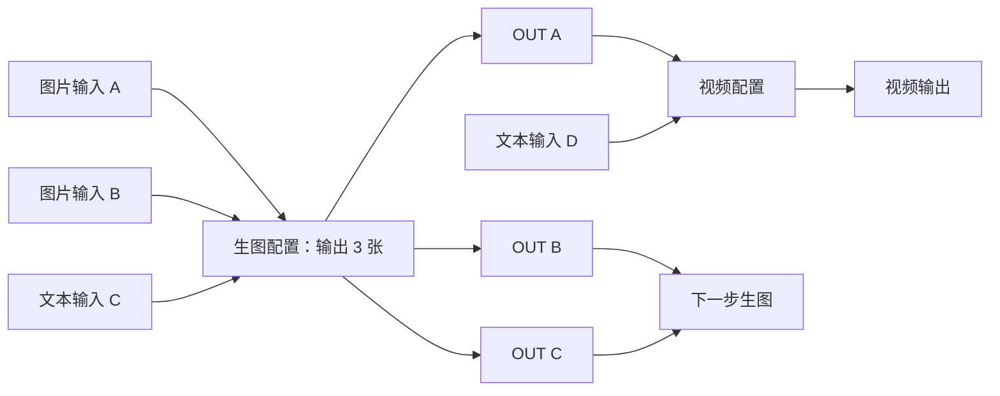

# 自动化流程模块架构与实施方案

- 项目：infinite-canvas
- 日期：2026-09-09
- 文档状态：待实施；已纳入 2026-09-09 确认的 HTML 预览交互调整
- 用途：作为 Workflow 模块的开发、阶段验收和上线准备依据。

## 1. 目标与范围

新增独立自动化流程模块，让用户搭建、保存并重复运行图片／视频生成流程。

### 1.1 已确认规则

- 将“公共素材”右侧的“管理”入口替换为“自动化流程”，保留右侧配置入口。
- 每个生成步骤最多 **9 个输入、9 个输出**，同时遵守所选模型的输入类型、参考数量和其他能力限制。
- 图片、视频、文本连接合计计入输入数量。多个输入一起作为参考素材，不自动逐项循环执行。
- 支持图片输入、视频输入、文本输入、生图步骤和视频步骤。
- 支持分支、汇合，关闭页面后继续后台执行。
- 某个输出失败，只阻塞依赖该输出的下游，独立分支继续。
- 保存流程时保留输入素材，下次运行前可以替换。
- 首版最终交付同时包含图片和视频；开发顺序先验证图片链路，再接入现有视频任务服务。

### 1.2 本版不包含

条件判断、循环、foreach、定时任务、跨用户流程分享、协同编辑、WebSocket、新消息队列、Redis 工作流队列、独立微服务、自动取消供应商任务，以及大规模普通 Canvas 重构。

## 2. 总体架构



保持在当前应用和数据库内实现。前端按 `workflows` 功能目录独立组织；后端沿用 handler、service、repository、model 分层，以 `workflow_*` 命名相关模块。

### 2.1 复用边界

| 能力 | 实施方式 |
| --- | --- |
| 流程编辑器 | 独立页面、编辑状态、保存和连线模型 |
| 卡片外观 | 提取必要的共享外框及展示组件，沿用现有视觉 |
| 图片与视频 | 复用上传、媒体访问、资源管理、封面、预览和播放 |
| 模型参数 | 复用模型配置、共享参数面板和能力校验 |
| 生成执行 | 直接调用现有 Go service，不通过内部 HTTP 请求自身接口 |
| 流程调度 | 独立维护依赖、并发、状态推进和恢复 |

不直接复用 `useCanvasGeneration`、普通 Canvas 的 autosave/history、selection/runtime 或页面内部状态。共享组件通过数据和事件参数工作，不读取 Workflow 或普通 Canvas 的页面状态。

不复制供应商适配器、生成轮询、计费、结果入库或 OSS 缓存体系。当前代码已有视频供应商、持久化视频任务、后台 Worker 和媒体入库能力；视频阶段以验证及接入为主，不按从零开发处理。

## 3. 编辑器与节点

“自动化流程”入口首先打开流程库，采用与“我的画布”一致的卡片列表布局；点击流程卡片进入对应的独立流程编辑器，编辑器提供返回流程库入口。流程列表支持新建、命名、保存、复制、删除；编辑器支持拖动、连线、缩放、平移、选择、模型配置和结果预览。

流程库展示流程名称、节点数、连线数、更新时间及保存状态，卡片操作保持轻量，点击复制等操作不同时进入编辑器。新建后进入空流程；保存后返回列表可以看到对应卡片，再次打开恢复该流程定义和输入媒体。

节点视觉沿用普通画布：

- 不在任何节点上方显示名称或步骤标题，包括“图片 A”“图片 B”“OUT A”和“01 · 产品图生成”等。流程名称仍显示在流程库卡片与编辑器顶部。
- 图片、视频输入及输出沿用现有媒体节点外框、圆角和展示方式；不增加“产品主体”“风格参考”“输入素材”等用途说明或额外说明栏。
- 文本节点直接展示可编辑提示词，不增加“文本 C”等节点标题。配置节点内部保留“生成配置”、预览、模式切换和参数等功能性内容。
- 图片输出卡片右下角增加轻量“重试”按钮，点击不触发节点拖动或整条流程运行；状态与执行语义见第 6.1 节。
- 沿用当前深浅主题、连线及控制条风格，不为 Workflow 单独引入另一套卡片视觉。

本次已确认的 HTML 预览用于布局与交互参考；其中本地保存、运行计时和重试反馈均为演示。正式模块仍按本方案使用服务端持久化和任务状态，不将预览脚本作为执行实现。

| 节点或展示元素 | 用途 |
| --- | --- |
| 图片输入 | 上传或选择图片，保存稳定媒体引用 |
| 视频输入 | 上传或选择视频，保存稳定媒体引用 |
| 文本输入 | 编辑提示词 |
| 生成配置 | 选择生图／视频、模型、参数和输出数量 |
| OUT 卡片 | 展示固定输出槽位及其结果，可继续连接下游 |

### 3.1 稳定输出槽位

OUT 在业务上属于生成节点，不是独立执行步骤。界面上可以显示为独立拖动的卡片，位置保存为槽位展示信息。

```text
生成节点 gen1
  ├─ slotA → OUT A
  ├─ slotB → OUT B
  └─ slotC → OUT C

连接：gen1.slotA → gen2.input1
```

- 每个输出有稳定 `slotId`，不随名称、位置、完成顺序变化。
- 配置三个输出时，提前显示三个 OUT，不等待生成完成后临时创建。
- 调整数量不得重新映射已有连线；删除已连接槽位时提示受影响连线。
- 输入端口明确类型，连接时按所选模型能力校验。
- 多个文本按输入端口顺序拼接。
- 保存允许缺少输入素材的草稿，但不允许循环或结构损坏的连线。
- 开始运行前再次校验输入完整性、类型、模型能力、数量和 DAG。

### 3.2 示例

以下图中的 A／B／C、OUT A 等仅用于解释依赖关系，不作为页面节点名称显示；隐藏名称不影响稳定节点 ID、槽位 ID 和连线绑定。



## 4. 数据模型与快照

| 数据 | 职责 |
| --- | --- |
| `Workflow` | 用户归属、名称、版本号、定义、创建及更新时间 |
| `WorkflowRun` | 定义与输入快照、来源版本、整体状态、停止标记、起止时间 |
| `WorkflowStepExecution` | 每个生成配置节点的汇总状态和错误 |
| `WorkflowOutputExecution` | 固定槽位、当前状态、当前尝试和结果媒体引用 |
| `WorkflowOutputAttempt` | 每次尝试的请求 ID、生成任务类型及 ID、状态、错误和时间 |
| `WorkflowMediaRef` | 定义和运行记录对输入、输出媒体的持有关系 |

### 4.1 定义保存

定义保存节点、端口、连线、位置、模型参数、默认文本、默认媒体引用和输出槽位配置。保存采用版本号乐观锁；冲突时提示重新加载，不静默覆盖另一页面修改。

所有数据和接口校验用户归属，不仅凭对象 ID 访问。第一版不提供跨用户流程分享。

### 4.2 运行快照

点击开始后创建独立运行记录，冻结当次定义及输入。之后编辑或保存流程不影响当前运行；不同运行的结果分别保留。

```text
Workflow v12 → Start → Run 保存 v12 快照
Workflow 保存 v13 → 原 Run 仍按 v12 执行
```

模型选择和用户参数不会跟随后续编辑变化。模型被禁用或用户失去权限时，未提交步骤明确报错，不自动改用其他模型。供应商配置和密钥仍由现有生成服务管理，不写入面向浏览器的流程定义。

## 5. 调度与生成执行

### 5.1 单槽位对应单生成任务

现有图片任务按单张创建。三个输出对应三个独立生成子任务，视频输出同样按槽位提交，继续使用现有计费规则。

流程模块只负责依赖判断、创建／找回任务、读取状态、接收 `mediaId` 和推进下游。供应商请求、轮询、计费、结果保存及错误映射仍归生成任务服务负责。

### 5.2 依赖规则

- 下游只等待自己实际连接的输出。
- OUT A 成功即可启动仅依赖 A 的下游，不等待无关的 B、C。
- 汇合步骤必须等所有连接输入成功。
- 必要输入失败时，依赖分支 blocked，其他分支继续。
- 已成功输出不因其他输出失败或重试而重新生成。

### 5.3 状态约定

运行状态包含 pending、running、stopping、completed、partially_completed、failed、stopped，并对存在待确认任务的情况提供明确可见状态。

槽位需要区分等待依赖、待提交、提交中、运行中、成功、失败、上游阻塞、待确认／需处理、未执行即停止。步骤状态由其槽位汇总，不独立驱动供应商调用。

正常收敛时：

- 全部计划输出成功：completed。
- 已有成功输出，其余存在失败或 blocked：partially_completed。
- 没有成功输出且已无可推进任务：failed。
- 待确认任务尚未解决时，不提前按普通失败收敛。
- Stop 后所有已提交任务收尾：stopped，保留已取得结果。

开始编码前将上述状态转换固定为测试，尤其覆盖部分成功、汇合阻塞和重试后的重新推进。

### 5.4 数据库领取与恢复

P3 从第一版就包含数据库 claim、lease、失效 Worker 写入保护，不能留到后续阶段才补。

- 使用项目现有等价模式或 PostgreSQL `FOR UPDATE SKIP LOCKED` 领取执行工作。
- 领取包含 claim 标识及租约，更新时校验有效归属，旧 Worker 不得覆盖新 Worker 的结果。
- 进程崩溃后允许接管；已有生成任务时继续跟踪，不直接新建收费任务。
- Run 创建和槽位尝试均使用去重标识，重复点击或请求重试不创建重复工作。
- 槽位请求 ID 由 run、node、slot、attempt 确定。
- 生成任务已创建、关联尚未写回时，使用同一个请求 ID 找回原任务。

调度器在服务端运行，浏览器仅创建运行、查询展示、Stop 和 Retry。浏览器关闭不影响后台推进。

### 5.5 并发限制

初始可配置值：

| 限制 | 默认值 | 口径 |
| --- | --- | --- |
| Workflow 全局并发 | 4 | 所有 Workflow 合计未结束的生成子任务 |
| 单 Run 并发 | 2 | 当前运行未结束的生成子任务 |

这不是仅限制同时发送 HTTP 请求的数量。提交中、运行中、保存中及结果待确认的任务仍占容量。容量检查、占用和释放必须在数据库中原子化，避免多实例共同突破上限。

本版不改变普通画布并发策略；现有生成 Worker 的限制继续生效。限制值集中配置，不散落硬编码。

## 6. Retry 与 Stop

### 6.1 Retry

失败不自动重新收费生成。

图片输出卡片提供独立重试入口，绑定当前运行的具体 `slotId`。失败时允许点击；请求提交后立即显示处理中并禁用重复点击，随后展示真实任务状态，失败时保留错误说明和再次重试入口。等待依赖、运行中或已成功时不允许通过该入口重复提交。待确认状态引导恢复原任务查询；已停止运行沿用 Stop 规则，通过新建运行重新执行。

该按钮只影响指定失败输出及其依赖恢复，不清空同级成功图片、不重跑整条流程。用户未要求成功图片的“重新生成”行为，本次不将它混入失败重试。

- 明确失败：用户重试指定槽位，新增 attempt，保留旧任务 ID 和错误记录。
- 已成功槽位不重跑；重试成功后重新评估被其阻塞的下游。
- 提交结果不明确：进入待确认状态，先查询原任务，不直接重提。
- 现有任务允许恢复查询时，沿用其恢复机制，不视为新一轮生成。
- 重试请求本身必须去重，避免连续点击创建多个新 attempt。

### 6.2 Stop

第一版 Stop 表示停止后续执行，不表示取消供应商任务。

- 停止标记生效后不再领取新的提交工作。
- 已进入提交过程的任务继续确认、收尾，结果正常保存。
- 未提交槽位标记为已停止，不永久停留在 waiting。
- 所有已提交任务收尾后，运行转为 stopped。
- stopped 运行不再推进；重新执行通过新建运行完成。

## 7. 媒体生命周期

定义、输入和结果只持久化 `mediaId`，不持久化临时 OSS 签名 URL 或 Blob URL。

使用独立关系表维护引用，不复制普通 Canvas 通过解析定义 JSON 判断媒体生命周期的做法。

- 约束引用的所有者、目标及唯一性，禁止无归属或重复引用。
- 保存、复制、创建运行、接收结果、删除记录时，在事务中同步维护引用。
- 生成结果落库到流程接收之间也要持有引用：在落库时建立保护，或由生成任务持续持有直到交接完成。
- 自动清理和手动删除同时检查 Canvas、公共素材、现有任务及 Workflow 引用。
- 沿用现有媒体行锁、deleting 状态、claim/lease 和条件删除协议。
- 第一版历史运行保留到用户主动删除；禁止删除未收尾运行。
- 删除流程不连带删除历史运行，运行通过自身快照和媒体引用继续完整保存。
- 最后一个引用解除后交由现有保留与清理机制处理，不直接删除 OSS 文件。

## 8. API

沿用现有认证、响应和错误处理方式。

| 方法与路径 | 用途 |
| --- | --- |
| `GET /api/v1/workflows` | 流程列表 |
| `POST /api/v1/workflows` | 新建流程 |
| `GET /api/v1/workflows/:id` | 读取流程 |
| `PUT /api/v1/workflows/:id` | 带版本校验保存 |
| `POST /api/v1/workflows/:id/copy` | 复制流程 |
| `DELETE /api/v1/workflows/:id` | 删除定义，保留历史运行 |
| `POST /api/v1/workflows/:id/runs` | 校验并创建运行快照 |
| `GET /api/v1/workflow-runs` | 运行列表 |
| `GET /api/v1/workflow-runs/:id` | 运行详情及步骤、槽位状态 |
| `POST /api/v1/workflow-runs/:id/stop` | 停止后续执行 |
| `POST /api/v1/workflow-runs/:id/retry` | 重试指定失败槽位 |
| `DELETE /api/v1/workflow-runs/:id` | 删除已结束运行并解除引用 |

所有操作校验 `owner_uid`。后台使用运行所属用户身份调用现有生成服务，并检查当前权限、模型及媒体可用性。列表分页，前端使用状态轮询，第一版不引入 WebSocket。

## 9. 实施阶段

| 阶段 | 交付内容 | 阶段验收 |
| --- | --- | --- |
| P1：定义与持久化 | 数据模型、CRUD、乐观锁、DAG 校验、媒体引用 | 可保存重开；跨用户和循环被拒绝；引用正确维护 |
| P2：编辑器 | 流程库卡片及进入／返回、新建保存重开、无外部标题的共享节点、端口连线、参数配置、图片重试入口状态 | 列表与“我的画布”风格一致；能搭建和保存图片／视频流程，暂不启动生成 |
| P3：图片执行闭环 | 快照、尝试记录、任务复用、并发、claim/lease、重启恢复 | 三个 OUT 乱序完成仍能正确推进分支及汇合 |
| P4：异常与生命周期 | 图片输出重试按钮接入槽位 Retry、Stop、待确认、旧 Worker 拒写、结果交接保护 | 单图重试不重跑成功结果；不重复提交、不丢结果、不误删引用媒体 |
| P5：视频接入与完整验收 | 接入现有视频任务，补齐具体缺口 | 图片→视频、视频参考→视频及混合流程可运行 |

每阶段先进行针对性验证，再执行受影响模块回归和 `git diff --check`。阶段汇报包括接口／数据变化、状态机、事务与并发边界、测试结果及剩余风险。

本方案不授权自动提交、推送或部署；需要提交时按当次明确授权处理。

## 10. 验收与上线准备

### 10.1 必须覆盖的场景

- 图片 A＋图片 B＋文本 C → 三个 OUT → 分支 → 汇合 → 后续生图／视频。
- 九进九出边界、模型参考限制、类型错误、缺少输入和循环连接。
- 输出乱序完成、部分失败、待确认、重复 Retry、Stop 与提交并发。
- 多实例领取、容量竞争、提交后崩溃、租约过期接管和旧 Worker 写回。
- 运行期间编辑流程、关闭页面后恢复、复制流程和保留历史结果。
- 媒体清理与流程保存并发、生成结果交接期间的保护和最后引用解除。
- 流程库卡片展示、新建、进入／返回、复制、删除和保存后重开；卡片操作不误触进入流程。
- 所有节点不显示外部名称和用途说明；图片、视频、文本及配置卡片与普通画布视觉一致，功能性控件正常保留。
- 图片输出右下角重试入口：只提交对应失败槽位、处理中防重复、成功结果不重跑、失败可再次重试、待确认先恢复查询；点击不拖动节点。
- 深浅主题、卡片拖动、连线、缩放、视频原生控件，以及普通画布回归。

执行相关 Go、Bun 测试、TypeScript 检查和生产构建。供应商行为默认模拟测试；真实图片和视频生成单独安排收费验收。

### 10.2 上线准备

- 上线前备份数据库，验证新增表迁移和回退边界。
- 日志关联 Run、步骤、slot、attempt 和生成任务 ID，不输出密钥或签名地址。
- 记录排队时长、执行时长、失败和恢复情况。
- 提供服务端开关控制新运行创建和新任务提交；关闭后仍允许已提交任务收尾。
- 首次上线受控验证图片和视频完整流程，再开放常规使用。

## 11. 完成标准

用户能够保存一套可重复使用的图片／视频流程，选择输入并点击开始后，系统可靠地在后台按连线推进，保留每一步可查看、可继续使用的结果；普通画布现有功能保持可用。
